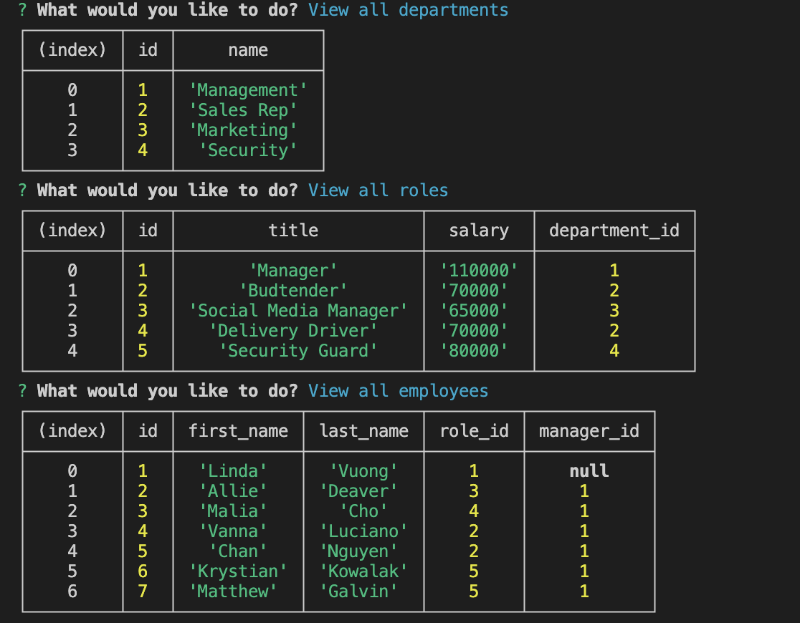

# employee-tracker

## Description
The motive behind this project was to create a content management system to keep track of employees. It will save the user a ton of time organizing departments, employees, salaries, etc. I learned how to create databases using mysql2, created a connection from the database to the server, create queries to display, add, and update information onto database. 
 
## Installation
1. Clone from repo.
2. Open folder with visual studio code or any text editor of choice.
3. Run ‘node app ‘in terminal to run code.

## Usage
1. Open repo in terminal.
2. Run ‘node app’ to start application
3. Input answers to populate desired results

## Video Demo Link
[Click here for Demo Video](https://drive.google.com/file/d/1AkwPa6Og8iwqYMuzLvjxIRxif-em8mIQ/view)